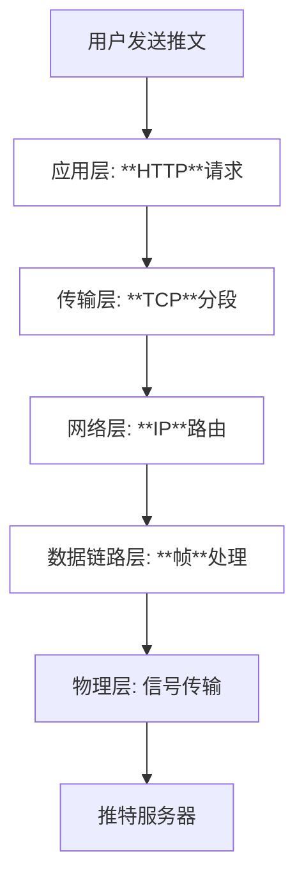

# example-发送一条推文

1. 应用层 (Application Layer)
   - 处理特定应用程序的协议
     - HTTP (网页)
     - FTP (文件传输)
     - SMTP (邮件)
     - 游戏专用协议
   - 生成用户数据
2. 传输层 (Transport Layer)
  - 数据分段
  - 添加信息
    - 端口号
    - 序列号
  -协议
    - TCP (可靠传输)
    - UDP (快速传输)

3. 网络层 (Network Layer)
  - IP协议处理
  - 添加地址信息
    - 源IP地址
    - 目标IP地址
  - 路由选择
  - 数据包转发
4. 数据链路层 (Data Link Layer)
   - 数据分帧
   - MAC地址处理
   - 错误检测
   - 流量控制
5. 物理层 (Physical Layer)
- 数据信号转换
  - 数字信号
  - 电信号
  - 光信号
- 物理传输介质
  - 网线
  - 光纤
  - 无线电波

# IP
IP在TCP/IP中的位置:

## IPv4首部：

H首部长度：4位，基本单位是4字节。

T总长度：16位，基本单位是1字节。

F片偏移：13位，基本单位是8字节。

### 占位 与 基本单位
基本单位
- 字段在计算长度时的单位
- 为了方便计算和处理而设定
- not直接表示字段在首部中的位数

占位
- 字段在首部中的位数

两者没有任何的connection

### Fragmentation 计算
已知
要求：
## IP v4——Subnetting
### 将一个C类网络208.115.21.0划分为4个子网
前面的数字保持不变，后面的.0依次替换为：
$00 = 0 $
$01 = 1 * 2^6 = 64 $
$10 = 1 * 2^7 = 128 $
$11 = 1 * 2^6 + 1 * 2^7 = 192 $
即
子网1：208.115.21.0
子网2：208.115.21.64
子网3：208.115.21.128
子网4：208.115.21.192
一个C类IP地址，其结构是前24位用于网络地址，后8位用于主机地址。
当这8位中的2位用于子网地址时，我们实际上是在使用这8位中的最高两位来表示子网。

#### 三类IP地址& 使用范围

## IPv4——Subnet Mask
- eg：(128.14.32.5/20)
  - 掩码是20个连续的1和后续12个连续的0
  - IP=10000000.00001110.00100000.00000101
  - 掩码=11111111.11111111.11110000.00000000
  - 网络前缀=10000000.00001110.00100000.00000000(128.14.32.0)

二进制运算 2^8=128

## IPv4——ARP ：硬件地址=MAC地址（**M**edia **A**ccess **C**ontrol Address）
硬件地址（Hardware Address），也称为物理地址（Physical Address）或**MAC地址**（Media Access Control Address），是分配给网络接口控制器（NIC）的唯一标识符。
用于局域网（LAN）或其他网络技术中进行通信。MAC地址通常由48位或64位二进制数组成，以十六进制表示，并且全球唯一。

MAC地址的作用是在网络中**标识**和区分不同的**设备**，使得数据包能够在网络中准确地从一个设备传输到另一个设备。
- 位于OSI模型的第二层，即数据链路层
- IP地址，位于第三层，即网络层

MAC地址的格式通常表示为六个字节，每个字节由两个十六进制数字组成，字节之间用冒号或短横线分隔。例如，00:1A:2C:3D:4E:5F就是一个MAC地址的例子。

 Windows系统中
<figure>
&emsp;&emsp;可以通过命令行使用ipconfig /all命令来查看电脑的MAC地址，或者通过系统网络中心来查看。

&emsp;&emsp;可以在连接到Wi-Fi时使用随机硬件地址，以增强隐私保护。

### ARP
ARP（Address Resolution Protocol）是IPv4协议族中的一种协议，它允许IPv4设备在局域网内通过MAC地址和IP地址进行通信。
#### 4种情况：
直接(连接的网络/路由器) → 直接用ARP在表中查找 MAC地址
间接（非直接连接的网络 上的主机/路由器）→ 用ARP找到下一个路由的MAC地址，剩下的交给它

