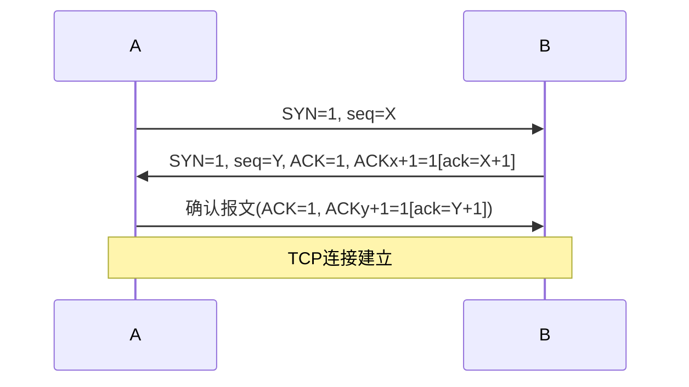

  👻

# TCP 
## 报文
### 端口
  - 不同计算机的 相同端口号 没有联系
### 首部
  - 窗口字段的值 → 自己接收窗口的尺寸 
### 报文段
- 对报文段的确认机制
  -  TCP是面向字节的，对每个字节都进行编号
  -  并不是对接收到的每个字节都要发回确认
     - 收到整个报文段后 → 一个ack
## 连接
### ACK、SYN、**FIN**=**1**
### 三次handshake
- eg;
  - 设A、B双方发送报文的初始序列号分别为X和Y
    - A发送(①)的报文给B,B接收到报文后发送(②)的报文给A
      -  B 接收到报文后，
         -  发给 A 的确认报文段中应使 
            -  SYN = 1, 使 ACK = 1，且确认号ack = X + 1
            -  即 $\color{green}{ACK}\color{purple}_{X+1}\color{black} = 1$（ACK 的下标为携带的序号），同时告诉自已选择的序号 $\color{blue}seq\color{black} = Y$
      - (ACK的下标为捎带的序号)
      - A发送一个确认报文给B便建立了连接

- standard
  - SYN=1,&emsp;&emsp;&emsp; seg=x 
  - &emsp;&emsp;~ , ACK=1,seq=y, ack=x+1 
  - &emsp;&emsp;×,&emsp;~&emsp;&emsp; ,seq=x+1,ack=y+1 
- 第三个报文
  - as above, 对$ ( ( 建立连接的\color{orange}请求\color{black}^① ) 的\color{green}确认\color{black}^② )的\color{green}确认^③$
### 标志位(ACK、SYN、**FIN**=**1**)&序号字段(seq/ack)
- explanation
  - 标志位(ACK/SYN/FIN)像开关，只有开(1)和关(0)
  - 序号和确认号像数值，可以是具体的数字

- eg:
  - A → B  seq=200, ack=201,数据部分有2个字节
    - 则B:
      - seq值应和A发向 B的报文中的 ack 值相同，即201
      - ack 值
        - 表示B期望下次收到A发出的报文段的第一个字节的编号(以sqe为standard)
        - 应是200+2=202
    - tips:
      - seq_B 同ack_A;
      - ack_B以sqe_A为起始
    - details
      - seq 表示发送的报文段中
        - 数据部分的第一个字节在 $A$ 的发送缓存区中的编号
      - ack 表示A期望收到的
        - 下一个报文段的数据部分的第一个字节在 $B$ 的发送缓存区中的编号
#### ack
- point接收方 希望next收到的报文段的数据部分 第一个字节 的编号
  - → get确认号为100的确认报文段
    - → 接收方希望下一个收到的报文段的数据部分的第一个字节编号为100
    - 末字节序号为99的报文段 已收到
## 释放
- 进程中的any一个都能提出释放连接的请求
## 控制

### rwnd
- rwnd &emsp;&emsp;cwnd  &emsp;&emsp;ssthresh
- 接收窗口  拥塞窗口   慢开始门限
  - rwnd 即**接收方** 允许**连续接收**的**能力**
### swnd 
- swnd 的值 → 可发送窗口的尺寸
  - swnd值由1000变为2000 → 可send 2000
    - (no matter 确不确认)
- 依据：swnd=min[rwnd，cwnd]

### cwnd
- Send端 根据网络拥塞情况确定的窗口值
- 大小
  - 在开始时可以按指数规律增长
### 滑动wnd
- ~是一种实现流量控制的方法
  - 不是拥塞控制的方法
    - 其机制中用到了滑动窗口
      - 这并不是~ 的作用
- 重传分组的数量
  - (at most) =滑动wnd size
- 值设置太大
  - 数据过多→路由器拥挤
  - 主机可能丢失分组
## TCP与UDP
### 首部
- TCP和UDP首部均含检验和
  - TCP检验和不仅检验数据，还检验TCP首部
  - UDP检验和仅检验数据
- TCP首部独有的是 **seq** 和 **ack**
#### 伪首部
##### 伪首部协议字段
- 用于指明上层协议是TCP还是UDP
  - 17 → UDP
  - 6 → TCP
##### 首部&伪首部' 区别
核心区别：
- **伪首部**是为了计算校验和而设计的临时结构，不参与实际传输
  - 包含了IP层的信息(源IP和目的IP)
- **首部**是**实际传输**数据包的组成部分
  - 首部不包含~